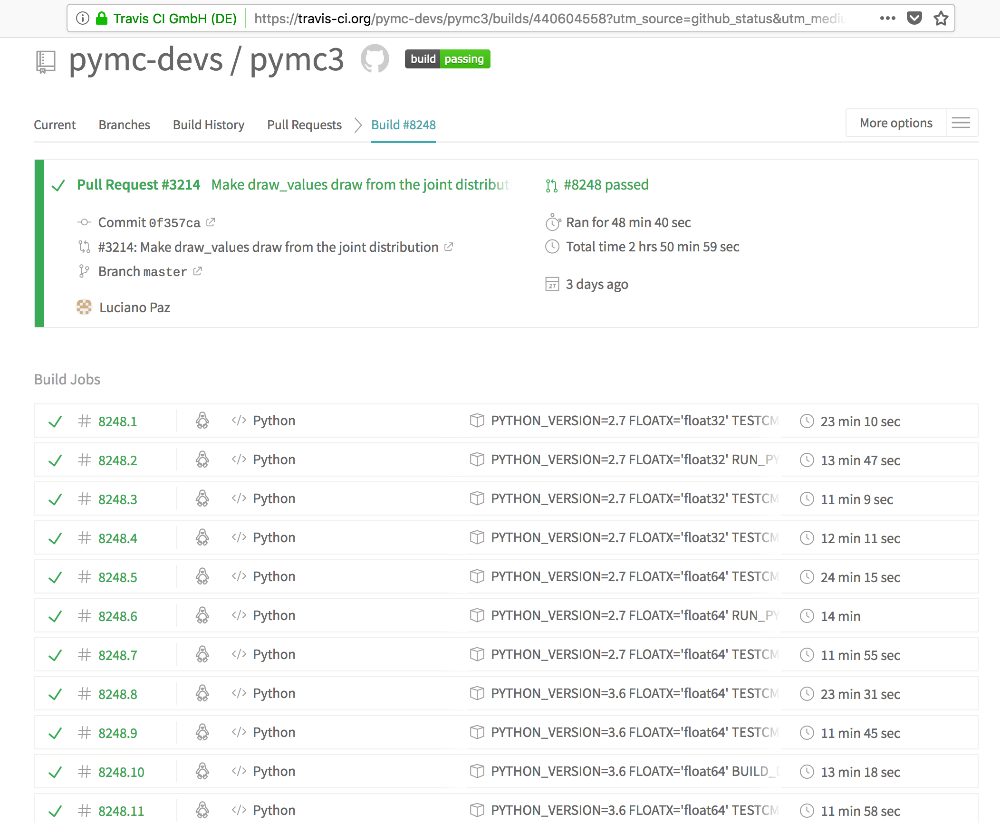

# Your first test
Test files are invoked with `pytest *insert test file or directory here*`

# Example of testing and continuous integration

## Python testing frameworks
* Built in Unittest
* Nose2
* pytest

## Why pytest
* From my experience needs the minimum amount of code
* Has nice features like fixtures and parametrization (We'll get this later)
* Used by all the projects I work on (pymc3, arviz, xarray, etc)

## Tests in Arviz
